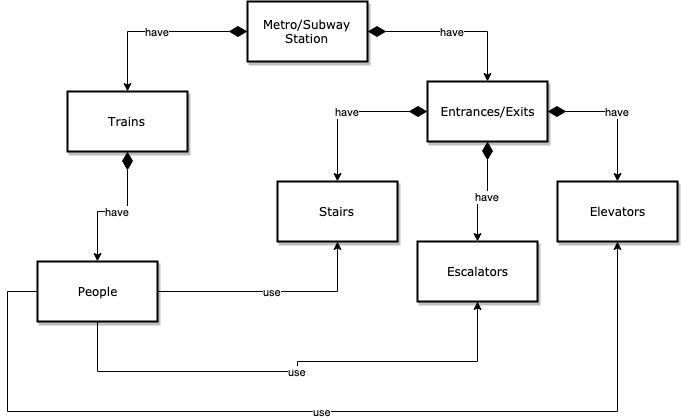
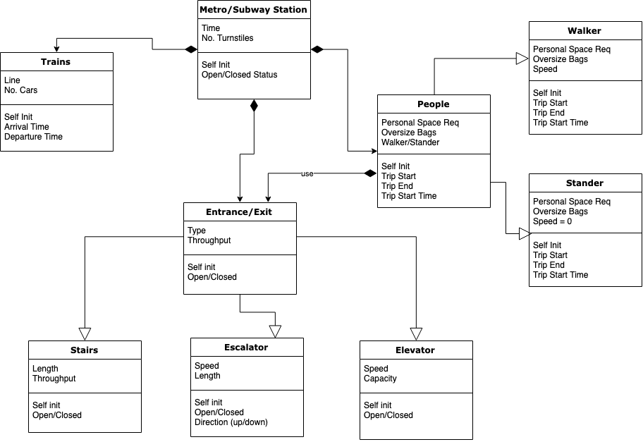
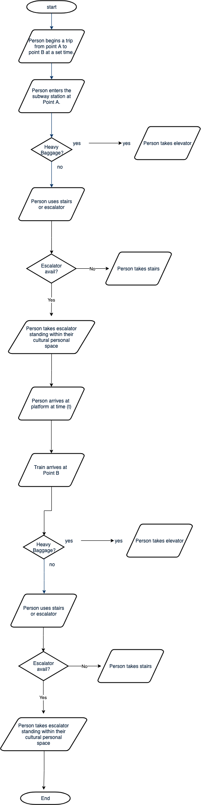
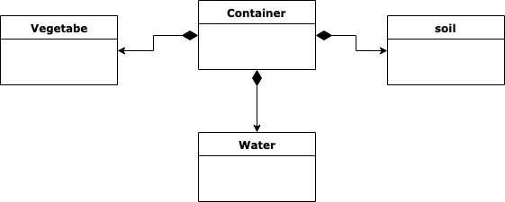
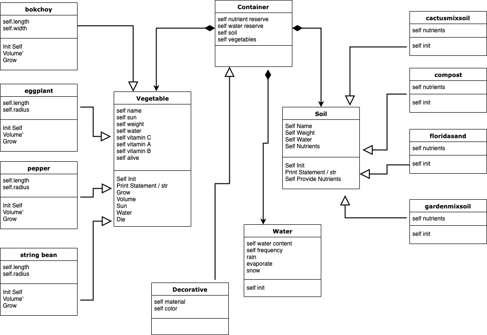
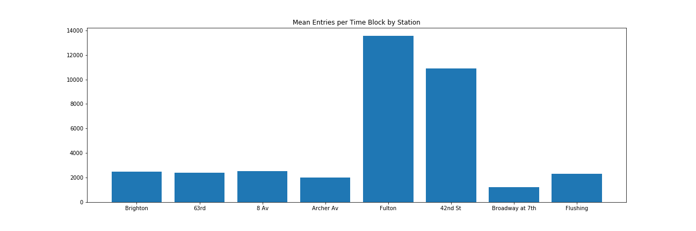
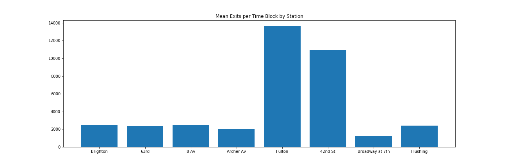
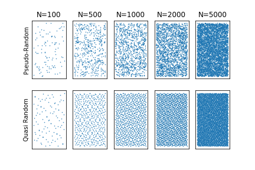
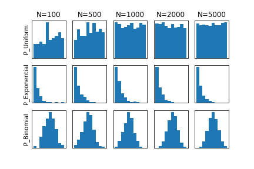
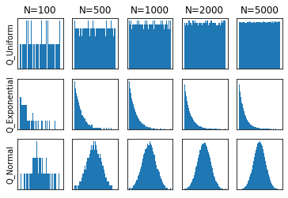

# Assignment 1 - Designing Models and Analyzing Data 

> * Participant name: Amanda Bond
> * Project Title: When Is Standing to the Right More Efficient? 

# General Introduction

The first part of this assignment explores designing models (and basic Python/Git features). 

We will look at **subway model in a city** system. A **subway system** is an underground, tube, or metro, underground railway system used to transport large numbers of passengers within urban and suburban areas - modern subways use different types of electronic data collection sensors to supply information which is used to manage assets and resources efficiently. 

The second part of the assignment explores data analysis. Data analysis and visualization is key to both the input and output of simulations. This assignment explores different random number generators, distributions, visualizations, and statistics. Additionally, it will look at getting you accustomed to specifying input and output variables to a system. We will also practice working with real data.

# Part 1: Designing a Model - Subway System

As cities grow, mass transit becomes more and more critical for the comings and goings of a city's residents.  Major cities with subterranean mass transit (New York, Boston, Washington, D.C., Paris, Munich, London, Tokyo, Hong Kong, and a myriad of other locations) are at a contstant battle to ease congestion and get passengers where they need to be within a reasonable amount of time.  Along with running trains, this also requires the need for efficient entrance and egress to the stations themselves - if you've ever been trying to get to the last train in Navy Yard after a Nationals Game in Washington, D.C., you know the congestion that can erupt with people clamoring to get on the trains.  

Historically, there is an unspoken book of etiquitte of the Subway and Metro systems. For example, see Thrillist's list of unspoken etiquette (https://www.thrillist.com/lifestyle/new-york/the-crowded-nyc-subway-etiquette-guide) on New York public transit.  Unspoken etiquette rules include the following: 

- Thou shall not put your belongings on a seat.
- Thou shall not play your music such that others can hear it.
- Thou shall not manspread.  
- Thou shall not hug, lean on, or otherwise use the poles for anything other than 'holding'.
- Thou shall not eat on the train, particularly if the food is pungent. 
- Thou shall let the people _off_ the train before you get on the train. 
- Thou shall give up your seat to the elderly, infirm, pregnant, or otherwise in need.
- Thou shall get thineself out of the way at the top/bottom of the escalator so as not to cause a pileup.  
- Thou shall stand to the right on escalators and let the stair-steppers proceed on the left. 

The overall goal is to make the commuting experience tolerable for all aboard.  However, the last etiquette bullet, standing on the right and allowing others to pass on the left if they're hoofing it up the stairs, is one that has recently been debunked as potentially not accurate, pending several variables (see https://www.youtube.com/watch?v=cX11cxeW6hA).  If throughput is significantly increased, there's reasonable impetus to change common behavior and have people fill in the entire escalator rather than standing only to the right. 

## (Part 1.1): Requirements (Experimental Design) **(10%)**

In order to investigate the research question, we have a set of requirements.  

We need a set number of inputs and parameters:
- Typical throughput by station for entrance and exit (preferably by time of day)
- Station charactieristics - does it have an escalator (or multiple escalators)? What is the size of the escalator(s)? 
- People, with paramaters such as walking vs. standing, having a carriage (will use elevator), personal space preferences (which can vary significantly by region), and others

We also have a set of functions that must be performed via simulation:
- Simulate people transiting across a city moving through stations
- Simulate trains arriving at various times to impact the "bunching up" that can occur at escaltors
- Simulate the throughput on specific escalators based on people movement

For output, we expect:
- Number of entrances / exits per hour using escalators (throughput)

## (Part 1.2) Subway (My Problem) Model **(10%)**

The model presented here demonstrates several key features, includng trains timing, station characteristics, and people charactieristics.  One of the critical facets of this model, according to my hypothesis, is the rule of personal space.  It is my estimation that cultural personal space will have impact on throughput efficiencies gained by using the "no walking" model for escalator use.  See the linked images below.  

* [**Object Diagram**]

 

* [**Class Diagram**]

 
 
* [**Behavior Diagram**]

 

## (Part 1.3) Subway (My Problem) Simulation **(10%)**

Roughly, I would simulate this with a mix of simulation types.  For the people, agent-based behavior seems to be the most applicable, particularly as I can give the agents variables for their goals as to if they would or would not use the stairs, personal space, etc.  Overall throughput, however, could be a continuous model across time, whereas the arrival and departure of trains carrying people - and cloggin up the escalators - could be discrete simulations.  The escalators themselves should be modeled using a continuous simluation, with the escalators operating at a continuous speed other than when they are switched from up to down and vice versa (when switching to peak hours operations).  

## (Part 1.4) Subway City (My Problem) Model **(10%)**
[**Code template**](code/README.md) - Starting coding framework for the (insert your exact problem here.)
You are expected to create the python files - the code should run without errors, create and object(s) for your system, but not provide function detail.

## (Part 1.5) Specifying the Inputs to a System **(10%)**

- Independent variables: Standing on escalators two abreast vs. standing to the right, escalator length and speed, individuals' notion of personal space
- Dependent variables: Throughput

In this case, the data available on data. gov for the New York City metro should suffice for the data regarding escalators, however getting the length of escalators may require additional data sources.  People should be randomly assigned to personal space preferences, though the data are available from Hall (1966). 

The statistics that will be most important here will be the average throughput, by hour, for individual stations.  Comparing the two dimensions of standing to the right vs. standing two abreast, when compared using a t-test or analysis of variance, pending other variables, will indicate a stastically signficant throughput change.  

These data will best be visualized using line graphs and even GIFs of throughput visualized as moving dots to demonstrate throughput, as seen here:  https://international.thenewslens.com/article/97109#&gid=1&pid=1 

Hall, E. T., (1966). _The Hidden Dimension_, Doubleday, NY.

# Part 2: Creating a Model from Code

## (Part 2.1) **P**ortable **O**rganic **T**rouble-free **S**elf-watering System (**POTS**) Model **(10%)**

The resulting Object and Class diagrams for the POTS system can be seen below. 

# Part 3: Data Analysis

## (Part 3.1) - Real Data **(10%)**

For Real World Data, I downloaded New York City turnstile data for 2018 from the U.S. data.gov website.  This data set provided the number of entries and exits per turnstile across stations, grouped by three-hour time block and date. 

As I was running the data to find out the basic descriptive statistics, two things quickly became evident: there are enormous numbers of people who go through the stations, and the number of entries and exits seem to be about equivalent (though I didn't do a test for equivalency).  This can be seen in the outputs of the entrances and exits per station that the python code outputs.  

I remembered from my travels to NYC, however, that not all stations have escalators.  Since that is the root of the question, I kept digging and found a data set that describes the entrances and exits by providing their latitude and longitude, if the exit has stairs, an elevator, and/or an escalator, and the station that the entrance/exit belongs to.  As it turns out, only about 27 specific entrances and exits across a handful of stations have escalators, unlike in the DC Metro where most if not all stations have escalators.  

Given that, I explored the data for just the stations with escalators.  It was clear immmediately which stations had the highest traffic, but this will provide a reasonable sample set across a few stations with varying characteristics across which simulations can be performed with and without queueing improvements.  

## (Part 3.2) -  Plotting 2D Random Number Generators **(15%)**

Below you will find random numbers generated using both the pseudo- and quasi-random methods.  Notably, the quasi-random patterns are much more "organized", given the distancing from previous points that quasi-random sampling entails.  By contrast, pseudo-random data appears in clumps of data, rather than an organized plot.  

## (Part 3.3) -  Plotting 1D Random Distributions **(15%)**

**Pseudo-Random Distributions**

**Quasi-Random Distributions**

Both the pseudo-random and quasi-random histogram distriutions look strikingly similar, omitting the differences in binning and other stylistic factors.  Whereas the two were markedly different for the N=100 and N=500 conditions, particularly, both are very similar distribution patterns across the histograms for all conditions. This indicates that, as the N increases, both could be used, pending the specifics of the problem state. 
