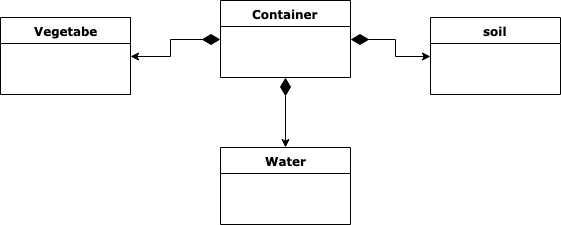
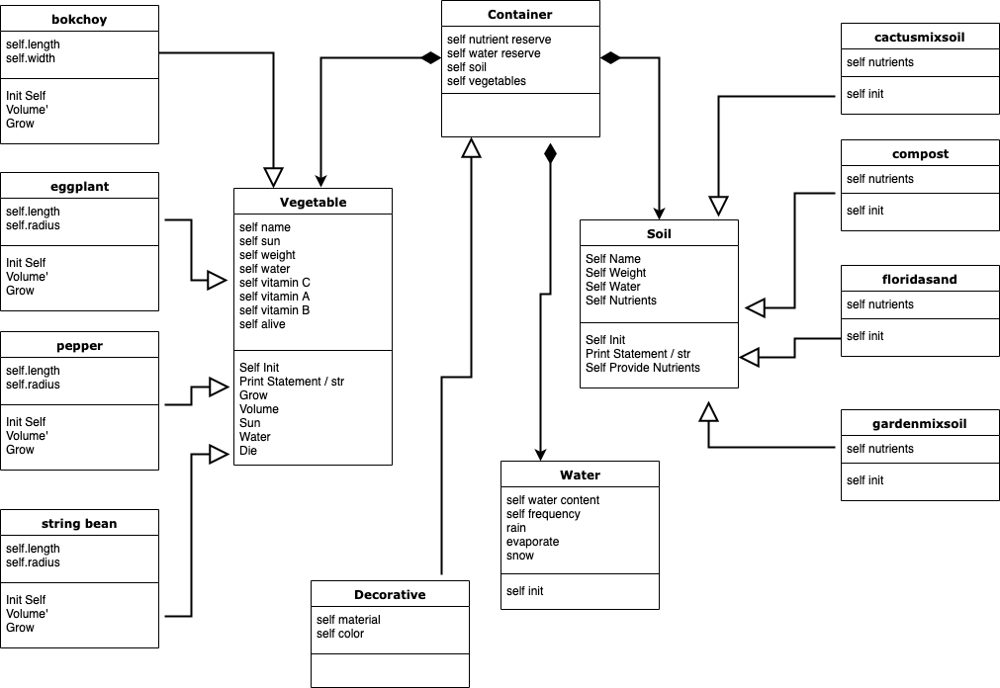

## **P**ortable **O**rganic **T**rouble-free **S**elf-watering System (**POTS**) Model

The Portable Organic Trouble-free Self-watering System (POTS) model is, as the name implies, a self-watering system that is comprised of multiple components.  As can seen by the object drawing below, the components are as follows: 
- Containers
- Vegetables
- Water
- Soil

**POTS Object Diagram**

There are four different classes of vegetable (bokchoy, eggplant, pepper, and stringbean), and there are four different classes of soil (garden mix, Florida sand, cactus mix, and compost).  Water, in multiple forms (snow, rain, irrigation) is also considered in the model, as is the type of container. See the Class Diagram below. 

Each object and class has its own properties and variants with respect to growth impact on the vegetables, and each vegetable has its own measurements, growth rates, and so forth.  

**POTS Class Diagram**
